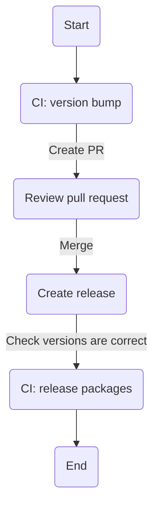

# Contributing

## Setup git hooks

It is recommended to setup git hooks to ensure code quality and consistency.

To setup git hooks, run the following:

```sh
git config core.hooksPath .githooks
```

## Install Deno

### Via asdf

[Guide](https://asdf-vm.com/guide/getting-started.html)

Once asdf is installed, run the following:

```sh
asdf install
```

### Via Deno docs

[Guide](https://deno.land/manual/getting_started/installation)

## Testing

To run tests, run the following:

```sh
deno task test
```

## Coverage

To check coverage, run the following:

```sh
deno task cov:check
```

To check report, run the following:

```sh
deno task report
```

## Release Process


